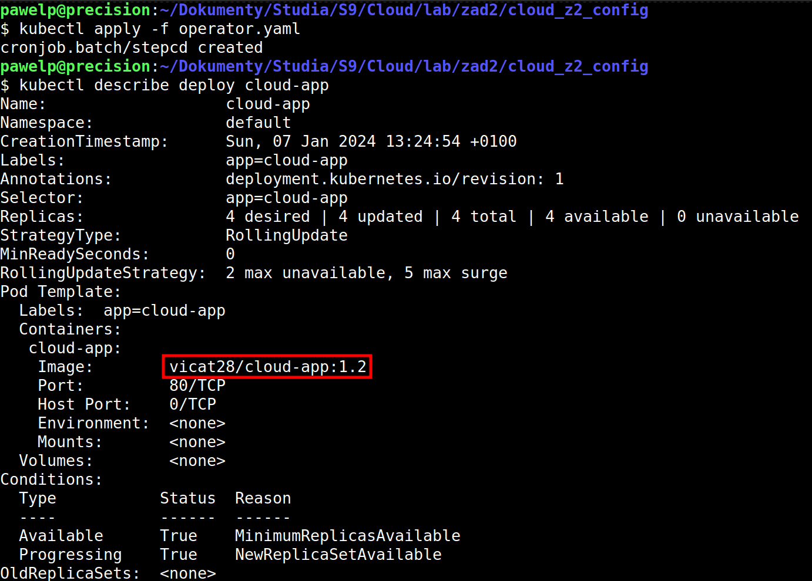

# Manifesty Kubernetes dla cloud-app
To repozytorium zawiera pliki manifestów Kubernetes odpowiedzialnych za prawidłowe uruchomienie aplikacji z repozytorium [cloud_z2_source](https://github.com/pawelp29/cloud_z2_source).

## Pierwsze uruchomienie systemu (4A)
W celu pierwszego uruchomienia systemu wykonano następujące polecenia:

```
kubectl apply -f deployment.yaml
kubectl apply -f service.yaml
kubectl apply -f ingress.yaml
kubectl apply -f operator.yaml
```

W celu sprawdzenia poprawności działania użyto polecenia `curl`:

```
curl http://zad2.lab
```

Poprawność utworzenia środowiska sprawdzono także za pomocą poleceń `kubectl`:

```
kubectl get deploy cloud-app
kubectl describe deploy cloud-app
```





## Wykonanie aktualizacji (4B)
W celu wykonania aktualizacji, w projekcie [cloud_z2_source](https://github.com/pawelp29/cloud_z2_source) zmieniono zmienną GitHub Actions odpowiedzialną za numer wersji i uruchomiono pipeline aktualizacji (więcej informacji znajduje się we wspomnianym repozytorium).

Po kilku minutach sprawdzono stan aplikacji:


